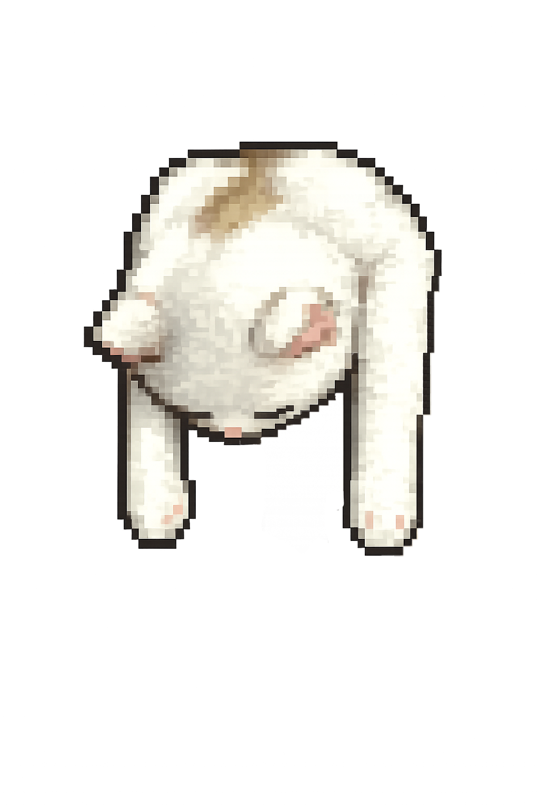
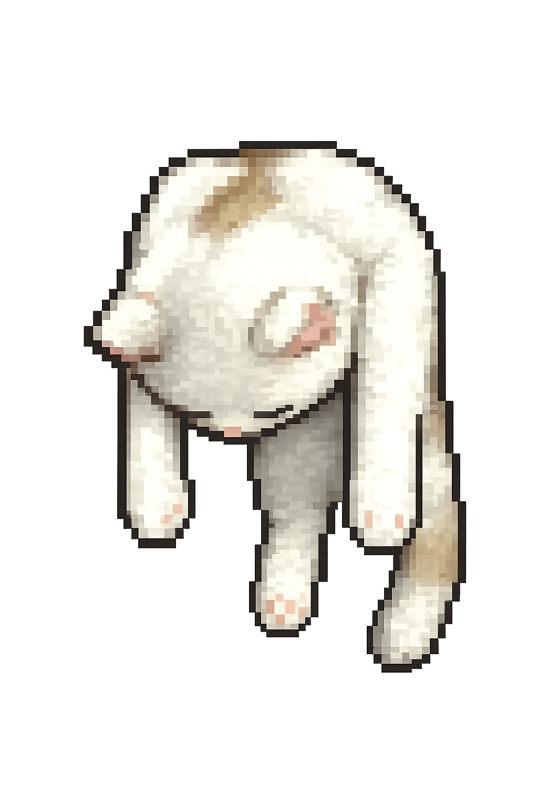

# hangCat

A tiny pixel cat that drapes over the top of your macOS windows. It hangs on the title bar of whichever window you're working with, follows the window when you drag it around, and you can flick it aside with a click when it covers something you need.

[简体中文](./README_CN.md)

<p>
  
  
</p>

## Install

1. Download `hangCat.app.zip` from the [latest release](../../releases/latest).
2. Unzip and drop **hangCat.app** into `/Applications`.
3. First launch will be blocked by Gatekeeper because the app isn't notarized. Either:
   - Right-click `hangCat.app` → **Open** → **Open Anyway**, or
   - Run once: `xattr -dr com.apple.quarantine /Applications/hangCat.app`
4. Grant **Accessibility** permission when prompted (System Settings → Privacy & Security → Accessibility). hangCat needs this to read window positions.

## Features

- **Drapes over the active window's title bar** — body sits on top, head + paws hang into the window.
- **Smooth follow on drag** — a `CGEventTap` mirrors mouse motion so the cat tracks the window with zero perceptible lag.
- **Click to swat** — click the cat and it slides aside along the title bar so you can reach a button it was covering.
- **Long-press to drag** — reposition the cat horizontally; it always snaps back to the title-bar height.
- **Two binding modes** (status bar 🐱 → 绑定模式 / Binding mode):
  - **Follow frontmost** — cat hops to whichever app is in front.
  - **Pin one window** — cat stays on a specific window. **Drag the cat onto another window's title bar to re-pin to that window.**
- **Adjustable size** (status bar 🐱 → 尺寸 / Size).
- **Hides when** the bound window is fullscreen, minimized, on another Space, or covered by another app's window.

## Build from source

```sh
git clone <your-fork-url> hangCat
cd hangCat
./scripts/make-app.sh         # produces hangCat.app and hangCat.app.zip
open hangCat.app
```

Requires Swift 5.9+ and macOS 14+. No third-party dependencies.

## How it works

| Concern | Approach |
|---|---|
| Find target window | `AXUIElementCreateApplication(pid)` + `AXObserver` for `kAXMovedNotification` / `kAXResizedNotification` / `kAXFocusedWindowChangedNotification` |
| Smooth drag follow | Global `CGEventTap` listening to `leftMouseDown/Dragged/Up`; offset the cat in real time |
| AX → CGWindowID | `_AXUIElementGetWindow` (private; loaded via `dlsym`, falls back gracefully if absent) |
| Hide when covered | `CGWindowListCopyWindowInfo(.optionOnScreenAboveWindow, targetID)` — public, cross-version-stable |
| Render | SwiftUI `Image` with `.interpolation(.none)` for crisp pixel scaling |

The cat sprite is at `.floating` window level. We deliberately avoid the private `CGSOrderWindow` z-order trick because its behavior shifted across macOS releases — instead we hide the cat outright when the target is occluded.

## License

MIT (see [LICENSE](./LICENSE)).
# hangCat
# hangCat
